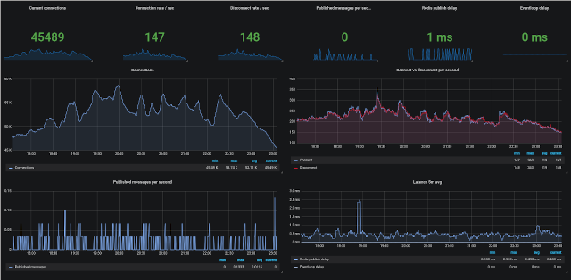

<p>

</p>

[](https://travis-ci.com/olesku/eventhub)
[](https://quay.io/repository/olesku/eventhub)

Eventhub is a pub/sub over WebSocket server written in modern C++.
It implements the [publish-subscribe pattern](https://en.wikipedia.org/wiki/Publish%E2%80%93subscribe_pattern) and concept of topics.

The key focus of the project is to deliver high performance, availability, and easy integration.

<p align="center">
<a href="./docs/images/grafana_dashboard.png">

</a>
</p>

# Concepts
## Topics

A topic is a feed name to which messages are published. Each topic can have as many subscribers and publishers as you desire. Every published message on a topic will get a distinct ID and be distributed to all clients that are subscribed to the topic or a topic pattern that matches.

A topic is segmented into paths and can contain a-Z, 0-9 and /.

### Examples ###
* ```myTopic```
* ```myTopic/foo/bar```

## Topic patterns

A client can be subscribed to a number of distinct topics, topic patterns, or both.
A pattern is similar to a regular expression that matches multiple topics in a single subscription.

*Note: Patterns is used for subscriptions only. You always have to publish to a distinct topic.*

Eventhub use the same layout for patterns as MQTT where ```+``` matches a single level and ```#``` matches multiple levels.

### Examples
* ```myTopic/+/bar``` matches ```myTopic/<anything>/bar```
* ```myTopic/#``` matches ```myTopic/<anything>```


## Eventlog
Eventhub stores all published messages into a log that can be requested by clients who want to get all events in or since a given time frame. For example if a client gets disconnected it can request this log to get all new events since the last event that was received.

## Authentication

When authentication is enabled Eventhub require every client to authenticate with a HS256 JWT token. The JWT token specifies which topics a client is allowed to publish and subscribe to. The token has to be hashed with the ```jwt_secret``` your Eventhub instance is configured with so it can be verified by the server.

Authentication token is sent to the Eventhub server either through the `Authorization` header or the ```auth``` HTTP query parameter.

**Example token**
```json
{
  "sub": "user@domain.com",
  "read": [ "topic/#", "topic2/#" ],
  "write": [ "topic1/#" ]
}
```

This token wil allow subscription to all channels under ```topic1``` and ```topic2``` and publish to any topic under ```topic1```.

Eventhub does not have a interface or API to generate these tokens for you yet. So you have to generate them in your backend or through a JWT token generator like [jwt.io](https://jwt.io/).

# Clients
* [JavaScript (Browser/Node.js)](https://github.com/olesku/eventhub-jsclient)
* [Swift (iOS 13+)](https://github.com/shtrihstr/EventHub)

#### Implementing your own client
Protocol specification for Eventhub is documented [here](./docs/protocol.md).

# Running the server

**Eventhub depends on a Redis server with pub/sub and streams support (version 5.0 or higher).**

## Configuration
Configuration file is specified using the ```--config``` command-line flag.
Example config file can be found [here](./eventhub.conf.example).

All configuration options can also be set using [environment variables](https://en.wikipedia.org/wiki/Environment_variable). If an option is specified in both the config file and environment variable the value from the environment will take precedence.

|Option name                  |Description                                    |Default value           |
|-----------------------------|-----------------------------------------------|------------------------|
|listen_port                  | Port to listen on                             | 8080
|worker_threads               | Number of workers                             | 0 (number of cpu cores)
|jwt_secret                   | JWT Token secret                              | eventhub_secret
|redis_host                   | Redis host                                    | 127.0.0.1
|redis_port                   | Redis port                                    | 6379
|redis_password               | Redis password                                | None
|redis_prefix                 | Prefix to use for all redis keys              | eventhub
|redis_pool_size              | Number of Redis connections to use            | 5
|max_cache_length             | Maximum records to store in eventlog          | 1000 (0 means no limit)
|ping_interval                | Websocket ping interval                       | 30
|handshake_timeout            | Client handshake timeout                      | 15
|disable_auth                 | Disable client authentication                 | false
|[enable_sse](docs/sse.md)    | Enable Server-Sent-Events support             | false
|enable_cache                 | Enable retained cache for topics.             | true
|prometheus_metric_prefix     | Prometheus prefix                             | eventhub
|default_cache_ttl            | Default message TTL                           | 60
|max_cache_request_limit      | Default returned cache result limit           | 1000
|log_level                    | Log level to use                              | info
|enable_ssl                   | Enable SSL                                    | false
|ssl_certificate              | Path to certificate for SSL                   | None
|ssl_private_key              | Path to private key for SSL                   | None
|ssl_ca_certificate           | Path to CA certificate                        | None
|ssl_cert_auto_reload         | Reload ssl cert when changed on disk          | false
|ssl_cert_check_interval      | How often to check for cert changes           | 300
|disable_unsecure_listener    | Disable unsecure listener when ssl is enabled | false

## Docker
The easiest way is to use our docker image.

To run locally with authentication disabled (for test), connecting to redis on
`my-redis-server.local`:

```sh
docker run --rm -e disable_auth=1 -e redis_host=my-redis-server.local -p 8080:8080 quay.io/olesku/eventhub:latest
```

The repo also contains a [docker-compose](https://docs.docker.com/compose/) file which will run both redis and eventhub for you.
To use that run ```docker-compose up```


## Building yourself

Required libraries:
* [Spdlog](https://github.com/gabime/spdlog)
* [Fmt](https://github.com/fmtlib/fmt)
* [Hiredis](https://github.com/redis/hiredis)
* [Redis-plus-plus](https://github.com/sewenew/redis-plus-plus)
* [OpenSSL](https://www.openssl.org/)

Required tooling:
* Git
* CMake
* Ninja
* Clang

```
git clone git@github.com:olesku/eventhub.git && \
mkdir build && \
cd build && \
cmake -GNinja -DSKIP_TESTS=1 .. && \
ninja
```

## Clustering
Eventhub has clustering capabilities, and it's easy to run multiple instances with the same datasources.
It's using Redis for intercommunication, so the only thing you have to do is to configure each instance to use the same Redis server.

## Metrics

Runtime metrics in [Prometheus](https://prometheus.io/) format is available at the `/metrics` endpoint.
JSON is available at `/metrics?format=json`

# License
Eventhub is licensed under MIT. See [LICENSE](https://github.com/olesku/eventhub/blob/LICENSE).
